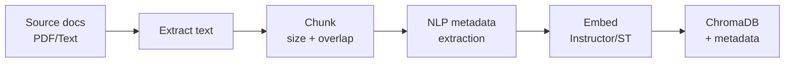
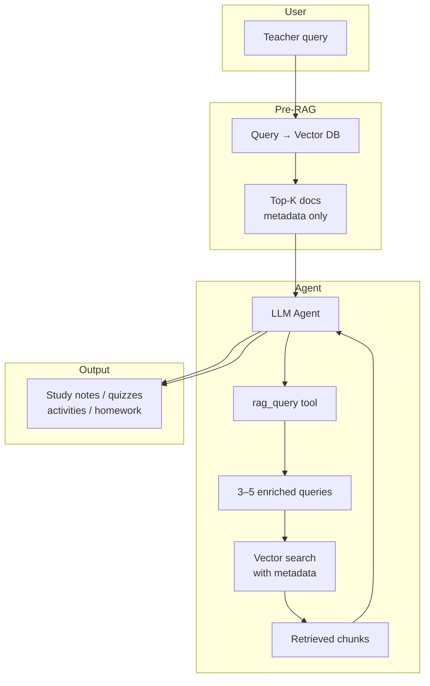
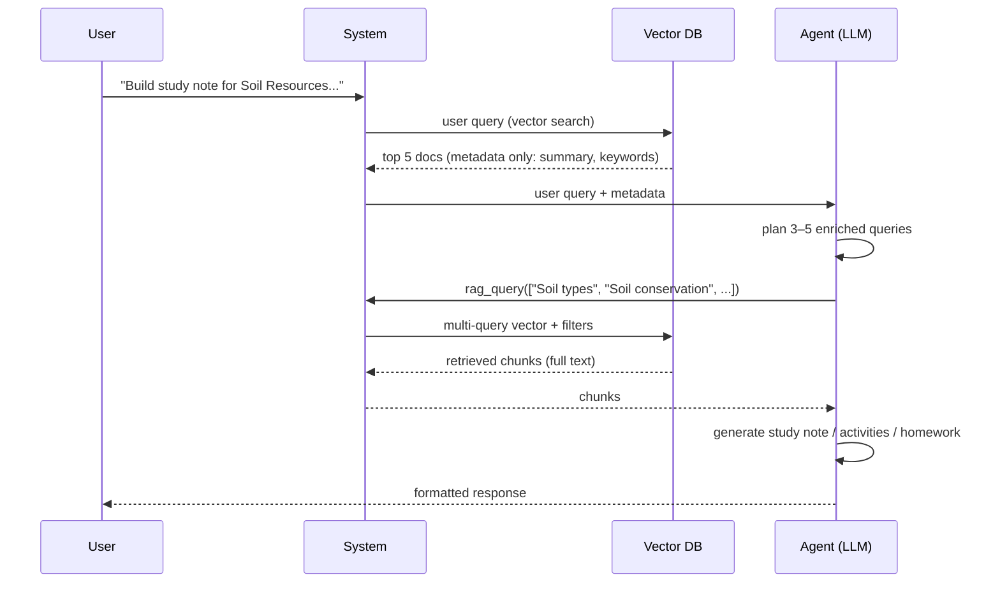

# Assignment 1: Gen. AI – Pre-Trained Models  
## RAG-Based GenAI Solution for Secondary School Teaching

**Job chosen:** Secondary School Teacher  
**Task:** Prepare how to teach a new lesson.  
**Total scope:** Conceptual design, architecture, prompts, RAG design, limitations, and platform implementation.

---

## 1. Detailing of Knowledge Base (KB) and Sample Query Format

### 1.1 Job and Task

| Item | Description |
|------|-------------|
| **Job** | Secondary School Teacher |
| **Task** | Prepare how to teach a new lesson (lesson planning, study notes, activities, homework) |
| **KB role** | Contextual help for new teachers using a RAG-based GenAI tool over curated curriculum materials |

### 1.2 Knowledge Base (KB) – Structure and Format

The KB is built from **Grade 10 Geography textbook** content: a single, coherent set of reference materials aligned to the curriculum. It is stored as **text documents** (chapters/sections) with the following characteristics:

- **Source:** Comprehensive reference materials (Geography of India, Map Work, and related topics).
- **Content structure:** Chapters and self-assessment sections; each logical section is a unit that can be chunked and indexed.
- **Format assumption:** Plain text or extracted text from PDF/HTML (e.g., one file per chapter or one consolidated file with clear section boundaries).

**Chapters / concepts covered in the KB:**

| Part | Topics |
|------|--------|
| **Part I – Map Work** | Interpretation of Topographical Maps; Location, Extent and Physical Features; Self Assessment Papers 1–2 |
| **Part II – Geography of India** | Climate; Soil Resources; Natural Vegetation; Water Resources; Mineral and Energy Resources; Agriculture; Manufacturing Industries; Transport; Waste Management; Self Assessment Papers 3–11; Practice Papers |

**KB storage and indexing:**

- **Vector store:** ChromaDB with cosine similarity.
- **Chunking:** Character-based sliding window (e.g., 2000 characters with 500 overlap) or token-based presets; overlap preserves context across boundaries.
- **Metadata:** Each chunk carries:
  - **System fields:** `filename`, `chunk_index`, `total_chunks`, `document_id`.
  - **NLP-derived fields:** `nlp_subject`, `nlp_document_type`, `nlp_language`, `nlp_keywords`, `nlp_summary`, `nlp_key_facts`, `nlp_reading_level`, etc., plus a rich JSON blob `nlp_meta_json` for retrieval and filtering.

This aligns with **metadata filtering** and **richer retrieval** (e.g., by subject, document type, keywords) as in established RAG practice.

### 1.3 Sample Query Format

Sample queries are in **natural language**, in English, and describe the teaching need (topic, type of material, and constraints). Examples:

| # | Sample query |
|---|-----------------------------|
| 1 | "I will be covering Soil Resources today in my class. Build me an exhaustive study note where I can easily catch up on core concepts, do some class activities, and give aligned homework. Ensure it's comprehensive to help me cover the topic fully." |
| 2 | "Build me a detailed study note to teach the Climate chapter in class. I want detailed notes on core concepts, some nice quizzes, activities, and important questions for the board." |
| 3 | "I want to teach Waste Management to my class – I want it to be interactive with activities, mind maps, flash cards, quizzes, and relevant homework." |

**Query characteristics:**

- **Intent:** Request for teaching aids (study notes, quizzes, activities, homework, mind maps, flash cards).
- **Topic:** Explicit (e.g., Soil Resources, Climate, Waste Management) or implied from context.
- **Constraints:** Grade 10, curriculum-aligned, board-relevant where applicable.

The solution is designed so that the **agent + RAG pipeline** can answer such queries by retrieving relevant chunks from the KB and generating structured, curriculum-grounded responses.

### 1.4 KB Ingestion Pipeline (High-Level)



*Screenshot reference: See `screens/step1_file_ingestion.heic` for file ingestion into the KB.*

---

## 2. Overall GenAI Solution Design

### 2.1 Can GenAI Help? – Degree and Scope

| Degree | Choice | Rationale |
|--------|--------|-----------|
| **Help level** | **Mostly (80%+)** | GenAI can draft lesson plans, study notes, quizzes, activities, and homework from the KB; it cannot replace classroom delivery, real-time adaptation, or formal assessment design without human review. |

**What GenAI can do:**

- Retrieve curriculum-aligned content from the KB (chapters, concepts, facts).
- Generate study notes, summaries, mind maps (text), question sets, and homework ideas.
- Suggest activities and structure (e.g., “do this activity, then quiz”).
- Stay on-topic and grade-appropriate when grounded in the KB.

**What GenAI cannot do (or should not do alone):**

- Replace teacher judgment on pacing, differentiation, or student feedback.
- Guarantee pedagogical correctness or board-exam alignment without human review.
- Create original copyrighted material; it should rely on the curated KB and cite/organize, not reproduce external copyrighted content.

### 2.2 Approach: RAG + Agent (No Fine-Tuning)

The solution is built by **prompting and RAG**, not by training or fine-tuning a model:

- **Base model:** Pre-trained LLM (e.g., Azure OpenAI / ChatGPT or similar) used via API.
- **Retrieval:** Vector search over the Geography KB (ChromaDB) with optional metadata filters.
- **Orchestration:** An **agent** that uses a **RAG query tool** to pull relevant documents and then generates the requested teaching materials.

So the approach is: **prompting + RAG**, with an **agentic** use of retrieval (multi-query, metadata-aware) to improve relevance.

### 2.3 High-Level Architecture



**Flow in words:**

1. **User** sends a natural-language query (e.g., “Build me a study note for Soil Resources…”).
2. **Pre-RAG step (metadata-first):** The system runs the user query against the vector DB and fetches **only metadata** (e.g., top 5 documents): summary, keywords, core concepts per chunk. This gives the agent a “map” of the KB without full text yet.
3. **Agent:** The LLM receives the user request plus this metadata. It then formulates **3–5 enriched queries** (e.g., “Soil Resources types”, “Soil conservation activities”, “Soil chapter key facts”) and calls the **rag_query** tool.
4. **RAG retrieval:** The tool runs these queries against ChromaDB (vector + optional metadata filters), retrieves the most relevant chunks, and returns them to the agent.
5. **Generation:** The agent follows its instructions (see Section 3) and produces the final answer: study notes, quizzes, activities, homework, etc.

This design combines **Agentic RAG** (agent decides what to retrieve and how to use it) with **multi-query** expansion and **metadata-aware retrieval**, as referenced in RAG literature (e.g., hybrid/metadata filtering, multi-query, agentic RAG).

### 2.4 Method of Estimating Success

- **Qualitative:** Manually check that sample queries (Section 1.3) return curriculum-aligned, on-topic content with no obvious hallucinations when the KB contains the topic.
- **Retrieval quality:** Inspect that retrieved chunks are from the correct chapter/topic (e.g., Soil, Climate, Waste Management) and that metadata (keywords, summary) matches the query intent.
- **Platform testing:** Run the same queries in the deployed solution (e.g., Intgr8 / Azure OpenAI / ChatGPT) and verify end-to-end behaviour (see Section 5).

---

## 3. Prompts and RAG Effectiveness Enhancement

### 3.1 System Prompt (Agent Role)

The agent is given a clear role and constraints so that it stays curriculum-focused and avoids unsupported or copyrighted content:

```text
You are a Grade 10 Teaching Assistant. Your role is to help teachers prepare lecture
materials by generating study notes, mind maps, question sets, anecdotes, and other
teaching aids based on the request you receive. Avoid providing personal opinions,
unrelated content, or any copyrighted material without proper attribution. Respond
in a clear, organized manner using headings and bullet points where appropriate,
and keep the tone professional and supportive.
```

### 3.2 Agent Instructions (Steps)

The agent is instructed to:

1. Read the teacher’s request and identify **subject**, **topic**, and **type(s)** of material needed.
2. If the request is ambiguous, **ask for clarification** before proceeding.
3. **Query the internal knowledge base** for accurate curriculum information, examples, and relevant facts (via the rag_query tool).
4. **Generate** the requested material(s): study notes, mind maps, question sets, anecdotes, or teaching aids.
5. **Format** the output with clear headings; use bullet points or numbered lists where appropriate.
6. **Self-check:** Ensure content is accurate, relevant to Grade 10, and free of obvious errors.
7. **Deliver** the final response to the teacher.

These steps enforce a **query-first, then generate** workflow and encourage use of the KB rather than unsupported claims.

### 3.3 RAG Effectiveness Enhancements Implemented

| Technique | How it is used in this solution |
|-----------|---------------------------------|
| **Metadata-first retrieval** | Before the agent runs, the user query is sent to the vector DB and **only metadata** (e.g., top 5 docs: summary, keywords, core concepts) is returned. The agent uses this to understand what the KB contains and then formulates better queries. |
| **Multi-query (enriched queries)** | The agent issues **3–5 enriched queries** to the RAG tool instead of a single query, improving coverage (e.g., different aspects of “Soil Resources”). The backend supports multiple comma-separated queries and merges results by best score. |
| **NLP metadata on chunks** | Each chunk has NLP-derived metadata (subject, document_type, keywords, summary, key_facts, reading_level, etc.). Retrieval can filter by these fields (e.g., `subject`, `document_type`, `keyword_contains`) so that only relevant chunks are considered. |
| **Re-ranking** | After vector search, results are re-ranked by lexical match (e.g., query terms in the chunk) and a minimum relevance threshold is applied to drop low-score chunks. |
| **Structured metadata filter** | ChromaDB `where` clauses are built from high-level params (`subject`, `document_type`, `language`, `keyword_contains`, etc.), reducing noise and improving precision. |

These choices align with **Advanced RAG** and **Agentic RAG** patterns (multi-step retrieval, use of metadata, agent-driven query formulation).

### 3.4 Relevant Code: Multi-Query and Metadata Filter

The following snippets illustrate how the solution supports **multiple queries** and **metadata filtering** in retrieval.

**Parsing multiple queries (e.g., from agent-generated list):**

```python
def _parse_multi_query(self, query) -> List[str]:
    """Parse query into up to 5 non-empty query strings (comma-separated or list)."""
    if isinstance(query, str):
        parts = [p.strip() for p in query.split(",") if p.strip()]
    else:
        parts = [str(q).strip() for q in (query if isinstance(query, (list, tuple)) else [query]) if str(q).strip()]
    return parts[: self._MAX_MULTI_QUERIES]
```

**Building metadata filter for ChromaDB:**

```python
def _build_metadata_where_clause(
    self,
    subject: Optional[str] = None,
    document_type: Optional[str] = None,
    language: Optional[str] = None,
    keyword_contains: Optional[str] = None,
    ...
) -> Optional[Dict]:
    conditions: List[Dict] = []
    if subject:
        conditions.append({"nlp_subject": {"$eq": subject}})
    if document_type:
        conditions.append({"nlp_document_type": {"$eq": document_type}})
    if keyword_contains:
        conditions.append({"nlp_keywords": {"$contains": keyword_contains}})
    # ... more filters
    if not conditions:
        return None
    return {"$and": conditions} if len(conditions) > 1 else conditions[0]
```

**Query flow:** Multiple query strings are combined with optional keyword list; vector search uses `where` when filters are present; results are merged by best score per document and then re-ranked.

### 3.5 Relevant Code: Chunking and NLP Metadata at Ingest

Chunking is character-based (or token-based via presets); overlap preserves context. Per-chunk NLP metadata (keywords, summary, key facts) is extracted in parallel and stored with each chunk.

**Chunking (character-based with overlap):**

```python
def _chunk_by_chars(self, content: str, chunk_size: int, overlap: int) -> List[str]:
    """Slide window by characters; chunk_size and overlap in characters."""
    step = chunk_size - overlap
    chunks = []
    start = 0
    while start < len(content):
        end = start + chunk_size
        chunk = content[start:end].strip()
        if chunk:
            chunks.append(chunk)
        start += step
    return chunks
```

**Adding a file to RAG (with NLP metadata):**

```python
def addFileToRag(
    self,
    file_name: str,
    content: str,
    chunk_size_key: str = "a4",
    metadata: Optional[Dict] = None,
    chunk_size: Optional[int] = None,
    overlap: Optional[int] = None,
    extract_nlp_metadata: bool = True,
) -> bool:
    # ...
    if chunk_size is not None and chunk_size >= 1000:
        chunks = self.getChunks(content, chunk_size_key=None, chunk_size=chunk_size, overlap=overlap)
    else:
        chunks = self.getChunks(content, chunk_size_key=chunk_size_key)
    # Document-level NLP on a sample; per-chunk NLP in parallel via thread pool
    # Then batch add to Chroma with ids, documents, metadatas
    self.collection.add(ids=ids_batch, documents=docs_batch, metadatas=metas_batch)
```

This ensures that at query time, retrieval can use both **vector similarity** and **metadata filters** (subject, document_type, keywords, etc.) for better effectiveness.

---

## 4. Identification of Solution Limitations

| Limitation | Description |
|------------|-------------|
| **TCO (Total Cost of Ownership)** | Running an LLM API (e.g., Azure OpenAI) and optional embedding/reranker models (e.g., Instructor, CrossEncoder) incurs usage cost. Local embedding/reranker reduce API cost but add compute and maintenance. |
| **Response time** | Metadata-first round trip + agent reasoning + 3–5 RAG queries + generation can take several seconds to tens of seconds. Not suitable for sub-second SLA without simplification (e.g., single-query RAG). |
| **KB coverage** | Answers are only as good as the KB. Topics not in the Geography textbook (e.g., out-of-syllabus or other subjects) will not be grounded and may lead to generic or incorrect content. |
| **Hallucination** | The LLM can still add plausible but wrong details. Human review of generated lesson plans and exam-related material is recommended. |
| **Metadata quality** | NLP metadata (subject, keywords, summary) depends on the content classifier. Misclassification can worsen filtering and retrieval. |
| **Scalability** | ChromaDB and thread pools are tuned for moderate scale; very large KBs or high concurrency may need sharding, caching, or a different vector store. |
| **Language** | The solution is designed for English (KB and queries). Other languages would require multilingual embeddings and possibly different NLP metadata. |

---

## 5. Efforts to Try Out the Solution on a Platform

The solution was implemented and tried on a real platform (e.g., Intgr8 / Azure OpenAI / ChatGPT-style agent chat):

- **Agent configuration:** A “Grade 10 Teaching Assistant” (or “Geography Quiz Master”) agent was set up with the system prompt and instructions above, and connected to a RAG backend that uses the same design (metadata-first, multi-query, ChromaDB, NLP metadata).
- **KB ingestion:** Geography textbook content was ingested into ChromaDB via the described pipeline (chunking, NLP metadata, embedding, batch add). *Screenshot: `screens/step1_file_ingestion.heic`.*
- **Testing:** Sample queries (e.g., Soil Resources study note, Climate chapter notes and quizzes, Waste Management activities and homework) were run through the chat interface to verify end-to-end behaviour. *Screenshot: `screens/step4_testing_agent.heic`.*

This demonstrates **significant** effort: real KB, real RAG pipeline, agent with rag_query tool, and testing with curriculum-aligned sample queries.

---

## 6. Summary and Possible Improvements

- **KB:** Grade 10 Geography textbook, stored in ChromaDB with chunk-level NLP metadata (keywords, summary, key facts, subject, document type, etc.) and optional metadata filtering.
- **Queries:** Natural-language teacher requests (study notes, quizzes, activities, homework) with explicit or implied topic and constraints.
- **Design:** RAG + agent (no fine-tuning): metadata-first retrieval, agent-formulated 3–5 enriched queries, vector + metadata retrieval, re-ranking, then LLM generation following fixed instructions.
- **RAG enhancements:** Metadata-first glimpse, multi-query expansion, NLP metadata on chunks, metadata filters, re-ranking, and clear agent instructions to query the KB before generating.

**Possible improvements (as noted in your idea):**

- **Chapter-level structure:** Treat chapters as first-class nodes (e.g., in a graph or hierarchy) so that retrieval can prefer or constrain by chapter, improving relevance for “teach chapter X” queries.
- **Preprocessing and classification:** Before ingestion, classify segments into types (e.g., concept notes, important questions, diagrams/figures) and store as metadata so the agent can request “give me concept notes and board questions” with filters.
- **Hybrid search:** Add sparse (e.g., BM25) search alongside vector search for terms like “San Andreas Fault” or “monsoon” to improve recall for specific phrases.

---

## References (conceptual)

- RAG techniques: Hybrid Search, Graph RAG, Re-ranking, Multi-Query, Agentic RAG, Metadata Filtering (e.g., IBM/Meilisearch-style summaries).
- Assignment problem statement and rubrics: *assignment.md*.

---

---

## Appendix: Screenshots and Optional Code (for 3-page appendix)

**Page guidance:** Main submission targets ~7 A4 pages; screenshots/code can extend by up to 3 more pages.

### A. Screenshots (reference by step)

| Step | Description | File |
|------|-------------|------|
| Step 1 | File ingestion into the KB (upload / chunking / indexing) | `screens/step1_file_ingestion.heic` |
| Step 4 | Testing the agent with sample queries (chat UI, responses) | `screens/step4_testing_agent.heic` |

*If you have step2 (e.g., KB/agent config) or step3 (e.g., RAG tool setup), add them here with the corresponding filenames from `screens/`.*

### B. Query Flow (Metadata-First → Enriched Queries)



### C. Embedding and Collection Initialization (from implementation)

```python
# ChromaDB collection with Instructor embedding (retrieval-oriented)
self.collection = self.client.get_or_create_collection(
    name=self.collection_name,
    embedding_function=embedding_function,
    metadata={"hnsw:space": "cosine"}
)
# Query supports multiple query texts + metadata where clause
results = self.collection.query(
    query_texts=query_texts,
    n_results=n_results,
    include=["documents", "distances", "metadatas"],
    where=where_clause  # optional
)
```

*End of submission.*
